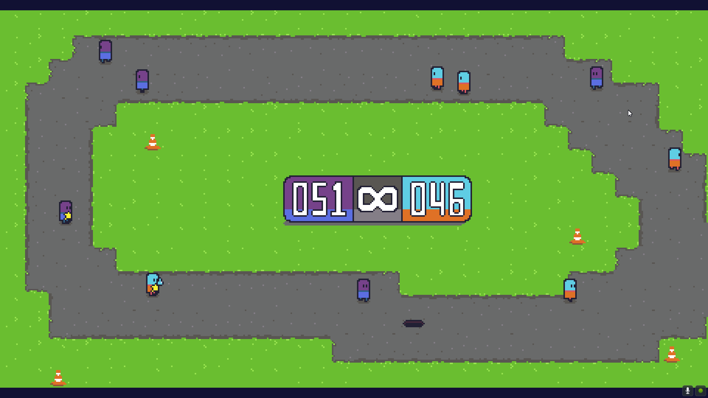
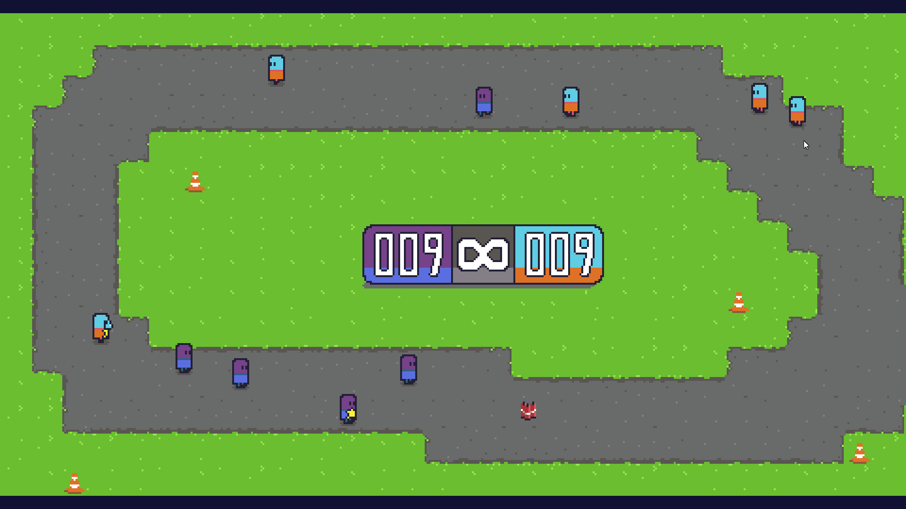
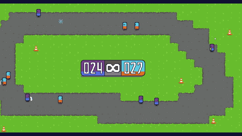

# Loop Runners

This is my entry for the [Ludum Dare 47](https://ldjam.com/events/ludum-dare/47) (LD47) Compo challenge. The theme for the event was *Stuck in a Loop*. The game I created is called Loop Runners which takes inspiration from the game of [Roller Berby](https://en.wikipedia.org/wiki/Roller_derby).

In Loop Runners there are two teams which consist of both *Jammers* and *Blockers*. Each team has a single *Jammer* player who is the only team member who can score points. Teams also consist of four *Blockers* which try to prevent the other team's *Jammers* from scoring points. You play as the *Jammer* on the purple team.

In the game of Roller Derby they play in periods of 30 minutes. However since the theme of LD47 is *Stuck in a Loop*, I decided to have there be only a single period and it will never end. I denoted this by adding an infinity symbol in the middle of the scoreboard.

During the game all players move counter-clockwise around a looping track. Everytime a *Jammer* passes an *Blocker* from the opposing team, they score a single point.

## Jammers
In Roller Derby the *Jammers* wear a gold star on their helmets to differentiate themselves from *Blockers*. For Loop Runners I decided to pay homage to his by adding a large start to the *Jammer* sprites.

## Blockers
The blockers will try to stay in front of the an approaching *Jammer* of the other team and shove them backwards when they get too close.

## Items
To add some spice to the gameplay, I added in item spawning at random-ish locations on the track. A randomly selected item will spawn every 13-ish seconds. Here are a list of the items that are included in Loop Runners:

* **Speed Boost** () - Gives the *Jammer* a quick boost of speed.
* **Freeze** () - Freezes all other players for a brief period of time.
* **Invisibility** () - Makes you invisible to the other team's *Blockers* for a short period of time.
* **Shuffle** () - Randomly shuffles around the locations of all players.
* **Teleportation** () - Randomly teleports you to a different location on the track.
* **Bomb** () - Pushes nearby players away from you.
* **Trap** () - Enstares the player for a short amount of time.

## Screenshots

# Development

The Ludum Dare Compo challenge is a 48 hour event where a single person must create a game from scratch based on a theme that is announced at the start of the event. Here is a list of development libraries that I used for this project:

* [Haxe](https://haxe.org/]) - programming language
* [Heaps.io](https://heaps.io/) - game engine
* [Deepnight's GameBase](https://github.com/deepnight/gameBase) - framework
* [LEd Haxe API](https://github.com/deepnight/led-haxe-api) - LEd integration

Here is a list of software tools that I used during the development of Loop Runners:

* [Visual Studio Code](https://code.visualstudio.com/) - integrated development environment (IDE)
* [Aseprite](https://www.aseprite.org/) - pixel art editor
* [LEd](https://deepnight.net/tools/led-2d-level-editor/) - 2d map editor
* [GDX Texture Packer](https://github.com/crashinvaders/gdx-texture-packer-gui) - texture packer
* [rFXGen](https://raylibtech.itch.io/rfxgen) - sound effects generator
* [Wavebots Editor](https://krasse.itch.io/wavebots-editor) - music and sound effects generator

# Personal Thoughts

This was my first Ludum Dare game jam that I have participated in, although I have done a handful of similar game jams in the past, but never one that was this short and that I did myself. Overall, I had a blast and highly encourage anyone who is interested in game development to give it a try. Actually I would probably encourage people to do it multiple times since you will continue to grow as you do more.

For this particular game jam, I felt like I managed my time fairly well and kept the game in a scope I could handle. This was my first time making something with the Haxe language, outside of a pre-warm up the weekend before. I had been reading up on it for the past couple weeks and after finding Deepnight's GameBase template on [GitHub](http://github.com), I decided to commit to using Haxe and Heaps along with this GameBase framework. I am really glad I did too, it was a great stepping off point. My main reference points that I had studied were Deepnight's [tutorials](https://deepnight.net/tutorials/) and the source code for his past Ludum Dare 45 entry, [Sabotage](https://github.com/deepnight/ld45).

I took the advice of many past LD participants and made sure I took breaks to go outside, ate enough food, and slept enough both nights. I found these simple steps super helpful. The breaks really gave me time to pace around in the fresh air and gather my thoughts on what to tackle when I got back to my desk.

I also want to give a thanks to my family for their time playtesting. My wife for taking my laundry chores for this weekend. :smile: And [Sébastien Bénard](https://twitter.com/deepnightfr) for his great tutorials, the LEd editor, and GameBase GitHub template.
